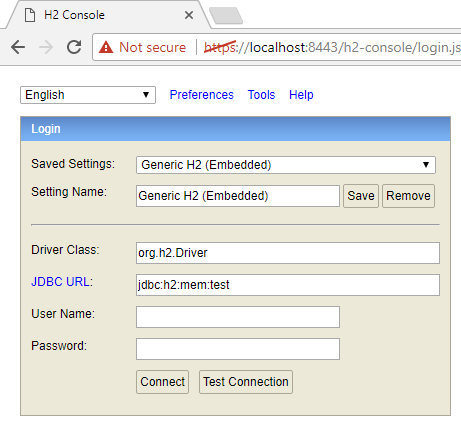

# Argiope
## About Me

My name is Preston Briggs and I am a Java developer specializing in the Spring suite of frameworks. I can honestly say I have found my passion in life and I am extremely lucky to truly enjoy what I do everyday. I have a love for all things technology and a constant dedication to self-growth. In my free time, if I’m not learning a new framework, developing my latest project or pondering to myself how something could be improved upon, you will likely find me at a local coding meetup or teaching Java to the robotics team at Pleasant Grove High School.

See [www.PrestonB.com](http://www.prestonb.com) for my resume, contact details and more example work.

## About Argiope

This app is simply just an outlet for me to apply and solidify my learnings of various frameworks/design patterns. Maybe one day it will evolve into a task management app or something to help with financial organization but for now it is just for educational purposes. It currently doesn't have much functionality as that is not the main objective. I am more focused on the quality of the code, applying various design patterns, improving my levels of abstraction and applying the latest features of a given framework's release.


## Table of Contents
1. Quick Start
   1. Prerequisites
   2. Download App
   3. Build/Run App
   4. Access App
2. Development Setup
   1. Prerequisites
   2. Import Project
   3. Run App
   4. Access App
3. Application Info
   1. Frameworks
   2. Tools
   3. Functionality
   4. Back-end Features
      1. Environment Abstraction (Spring feature)
      2. Profile Starter Sets (Argiope feature)
      3. Properties Content Assist (Spring feature)
      4. Maven Wrapper (Spring feature)
      5. Performance Testing
   5. Development Features
      1. Auto-generated Dev Users (Argiope feature)
      2. Dev Tools (Spring feature)
      3. Properties Template (Argiope feature)
      4. Method Trace Logging
      5. H2 Console (Embedded DB)
      6. Dev Directory
      7. Run Configs
      8. SQL Scripts
      9. Hibernate Generated Entities
4. How To
   1. Override Properties
   2. Enable Method Trace Logging
   3. Enable Performance Testing
   4. Run Automation Testing
5. Information
   1. Profile Precedence
6. Appendix


## 1. Quick Start

------

Follow this section to get up and running quickly on your local for **view only** purposes (for development environment setup see the Development Setup section).

### Prerequisites
1. **Java 8 JDK installed**

   1. [JDK8 download](http://www.oracle.com/technetwork/java/javase/downloads/jdk8-downloads-2133151.html) site

   2. See Appendix section for instructions

2. **`JAVA_HOME` path set**

   1. See Appendix section for instructions

3. **Git installed** (Optional)
   1. [Git download](https://git-scm.com/download/win) site
   2. Alternative: Instead of cloning the project from git, you can download the project zip directly from github [here](https://github.com/rededge-github/Argiope/archive/master.zip).

### Download App
1. With git: `git clone https://github.com/rededge-github/Argiope.git`
2. Without git:
   1. Navigate to the [Argiope master branch](https://github.com/rededge-github/Argiope/tree/master)
   2. Select the green 'Clone or Download' dropdown
   3. Select 'Download ZIP'

### Build/Run App
1. Navigate to the project's root dir (Same directory where `mvnw` file exists)
2. Clean, build and run app:  `mvnw clean spring-boot:run`
### Access App
1. Navigate to the home page in your browser: http://localhost:8080

2. Accept any warning about '*Your connection is not private*'
   1. This is due to the app redirecting all non-secure (HTTP) connections to a secure (HTTPS) connection (and chrome not recognizing my self-signed certificate)
   2. As of Argiope `0.2.0-RELEASE`: You can disable the require HTTPS feature by running the app using the following command:  
     `mvnw clean spring-boot:run -Drun.jvmArguments="-Dcom.preston.argiope.sec.require-https=false"`
    3. If running with the previous command, `Requiring HTTPS transport` should **NOT** be seen in the console output:
```
DEBUG 14192 --- [  restartedMain] pConfig$$EnhancerBySpringCGLIB$$d354e968 : Processing security configurer [RequireSecureTransportWebSecurityAdditionalConfigurer].  
DEBUG 14192 --- [  restartedMain] TransportWebSecurityAdditionalConfigurer : Requiring HTTPS transport.
```

3. Login with:
   1. Username: sa
   2. Password: sa
   3. Note: This information is also displayed on the login page during dev mode (the default):
     


## 2. Development Setup

------

### Prerequisites

1. [Java 8](http://www.oracle.com/technetwork/java/javase/downloads/jdk8-downloads-2133151.html) installed
2. [Eclipse STS][STS Link] (Spring Tool Suite) installed
   1. This is an IDE geared towards developing Spring applications, and is especially helpful with Spring Boot applications like this one
   2. This is not necessarily required (Standard Eclipse will work) however this README is based on Eclipse-STS
### Import Project

Import as a maven project (or alternatively checkout from git directly in Eclipse)

### Run App

In the Spring dashboard, select one of the run-configs to run (standard 'dev' is a good starting point)


These should show up by default but if not, they should be located at `/dev/run-configs/`

### Access App

- Default port is 8080 (redirects to 8443)

- Login credentials should be displayed on login page:

  


## 3. Application Info

------

### Frameworks

| Type                   | Name/Link                                |
| ---------------------- | ---------------------------------------- |
| Dependency Injection   | [Spring](http://docs.spring.io/spring-framework/docs/current/spring-framework-reference/htmlsingle/) |
| MVC                    | [Spring Web](http://docs.spring.io/spring-framework/docs/current/spring-framework-reference/htmlsingle/#spring-web) |
|                        | [Spring Boot](http://docs.spring.io/autorepo/docs/spring-boot/current/reference/htmlsingle/) |
| Security               | [Spring Security](http://docs.spring.io/spring-security/site/docs/current/reference/htmlsingle/) |
| AOP                    | [Spring AOP](http://docs.spring.io/spring-framework/docs/current/spring-framework-reference/htmlsingle/#aop) |
| ORM                    | [Spring Data](http://docs.spring.io/spring-data/commons/docs/current/reference/html/) |
| ORM                    | [JPA/Hibernate](http://hibernate.org/orm/documentation/5.1/) |
| Transaction Management | [Spring Transaction](http://docs.spring.io/spring-framework/docs/current/spring-framework-reference/htmlsingle/#transaction) |
| Logging                | [Logback](https://logback.qos.ch/documentation.html) implementation of [Slf4j](https://www.slf4j.org/docs.html) |

### Tools

| Type                             | Name/Link                                |
| -------------------------------- | ---------------------------------------- |
| Preferred IDE                    | [Eclipse-STS](https://spring.io/tools/sts/all) (Spring Tool Suite) |
| Build                            | [Maven](http://maven.apache.org/guides/) |
| Servlet Container                | [TomCat](http://tomcat.apache.org/tomcat-7.0-doc/) |
| Embedded Datastore (Development) | [H2 Embedded DB](http://www.h2database.com/html/main.html) (Enabled by default) |
| Physical Datastore               | [SQL Server](https://www.microsoft.com/en-us/sql-server/sql-server-2016) (Enabled based on profile) |
| Source Control                   | [Github](https://github.com/rededge-github/Argiope/tree/master) |
| Datastore Source Control         | Yet to be implemented (Potentially Liquibase) |
| Automation Testing               | [Selenium](http://www.seleniumhq.org/docs/03_webdriver.jsp) ran by [TestNG](http://testng.org/doc/documentation-main.html) |
| Unit Testing                     | Yet to be implemented                    |
| Hosted Environment               | [AWS](https://aws.amazon.com/documentation/) |

### Functionality

*Once again, this app is not currently very feature rich since it is simply just an outlet for me to apply and solidify my learnings of various frameworks/design patterns.*

- Authentication (Login/Logout)
- Authorization (Access Denied/403 Page)
- Brute Force Attack Prevention
- Create User
- Delete User

### Back-end Features

#### Environment Abstraction (Spring feature)

Spring provides an environment abstraction in the form of Spring `Profiles`. Beans can be conditionally included/excluded based on a specific profile being active (or inactive). In addition to beans being picked up by the container conditionally, Spring also picks up all `application-${profileName}.properties` files for the active profiles.

More info can be found in the [Spring Reference Documentation](http://docs.spring.io/spring-framework/docs/current/spring-framework-reference/htmlsingle/#beans-environment).

#### Profile Starter Sets (Argiope feature)

Taking after Spring’s ‘*opinionated*’ approach to wiring up an application, I created a set of ‘starter’ profiles that can be used to get up and running quickly, while still allowing overriding/adding of configuration as needed. Each starter simply activates a group of profiles that are meant to work together.

  - **starter-set-dev-1** (Default) 

    Activate the common set of dev beans and run in an embedded tomcat container using an embedded H2 database.

    - dev
    - dev-embedded-server
    - dev-embedded-db 
  - **starter-set-dev-2** (Drop-create)

    Same as the default starter but drop and recreate the embedded database with each restart

    - dev
    - dev-embedded-server
    - dev-embedded-db
    - *<u>dev-drop-create-db</u>*
  - **starter-set-dev-3** (H2 Console)

    Same as the default starter but enable the H2 console. The H2 console is available at: http://localhost:8080/h2-console. (*The console is not activated by the default dev profile because it requires disabling csrf token generation.*)

    - dev
    - dev-embedded-server
    - dev-embedded-db
    - *<u>dev-h2-console</u>*
  - **starter-set-dev-4** (Physical DB)

    *Same as the default starter but use a physical database (SQL Server) instead of the embedded database*

    - dev
    - dev-embedded-server
    - dev-*<u>physical</u>*-db

- **starter-set-dev-5** (Physical DB + Drop-create)

  *Same as the Physical DB starter but point to a special 'Droppable' database and drop/recreate it on each server restart*

  - dev
  - dev-embedded-server
  - dev-physical-db-drop
  - *<u>dev-drop-create-db</u>*


#### Properties Content Assist (Spring feature)

Eclipse-STS provides content assist for properties files similar to what we are used to in Java classes. Simply start typing `com.preston.` to see a list of the possible properties as well as the data type, the default value, possible values and a description (if configured).


Spring accomplishes this by scanning the code for `@ConfigurationProperties` annotated beans and adding their members as properties. The configuration file generated can be found at `target/classes/META-INF/spring-configuration-metadata.json`. Any additional configuration we want can be added via `classpath:/META-INF/additional-spring-configuration-metadata.json`.

Only properties files opened with the `Spring Properties Editor` will have content assist. By default this is only `application.properties`. You can either change the default editor for all `.properties` files or you can right click each one and select `Open With > Spring Properties Editor` and the IDE will remember each file from then on.

More info on properties content assist can be found in the [Spring Boot Reference Documentation](http://docs.spring.io/autorepo/docs/spring-boot/current/reference/htmlsingle/#configuration-metadata).

#### Maven Wrapper (Spring feature)

All Spring starter projects come with a Maven wrapper so you no longer need to concern yourself with installing, configuring and synchronizing the same version of Maven across the team. 

Instead of calling `mvn` from the project root, just replace it with `mvnw`.

#### Performance Testing

AOP is used to monitor method execution time performance (when enabled). This data is stored in the `[audit].[performance_monitoring_result]` table and can be used to run reports between releases or before pull request merges.


See the How To section for how to activate this.

### Development Features

This section contains features that only enhance the development aspect of the application and are not meant to be used in a production environment.

#### Auto-generated Dev Users (Argiope feature)

If the dev profile is active, a default user and an automation testing user will be deleted and created on application startup. The dev user's login information will be displayed on the login page for convenience:


Also, all dev users will be printed to the console during instantiation (notice `username=sa, password=sa` and `username=AutomationTesting01, password=testpassword01`):

```
INFO 10844 --- [  restartedMain] c.p.a.app.init.dev.DevUserInitializer    : Creating dev user on startup: CreateUserForm [firstName=PasswordIs, lastName=sa, username=sa, password=sa, roles=[ADMIN, USER]]
INFO 10844 --- [  restartedMain] c.p.a.app.init.dev.DevUserInitializer    : Creating dev user on startup: CreateUserForm [firstName=Automation, lastName=Testing, username=AutomationTesting01, password=testpassword01, roles=[ADMIN, USER]]
```


#### Dev Tools (Spring feature)

Spring has a handy dev-tools dependency that you can add to your classpath to automatically **configure many different handy loggers** (not just Spring loggers), **turn off caching for template engines** like Thymeleaf and **add an 'Automatic Restart' feature** to only recompile <u>your</u> code during a hot swap (not the hundreds of 3rd party JARs that aren't going to change). This drastically reduces restart time.

```
<dependency>
  <groupId>org.springframework.boot</groupId>
  <artifactId>spring-boot-devtools</artifactId>
  <optional>true</optional>
</dependency>
```

More information on dev-tools can be found in the [Spring Boot Reference Documentation](http://docs.spring.io/autorepo/docs/spring-boot/current/reference/htmlsingle/#using-boot-devtools).

#### Properties Template (Argiope feature)

See the `src/main/resources/config/template.properties` file for a list of ***helpful*** configurable properties for this app and the frameworks it uses. Note that this is **not** an exhaustive list; content assist in a `.properties` file will display any properties defined in an `@ConfigurationProperties` annotated class. 

Also the [Spring Boot Reference Documentation](http://docs.spring.io/autorepo/docs/spring-boot/current/reference/html/common-application-properties.html) has a handy list of common properties.

#### Method Trace Logging

AOP is used to log the execution of methods within the layers specified. This can be useful for tracing down issues or verify the correct methods are being executed without having to step through code. 

##### Nested Method Indentation

Nested method invocations are indented to display their level in the stack trace. This makes it easy to see 'jumping' in and out of method invocations.

```
: Creating dev user on startup: CreateUserForm [firstName=Automation, lastName=Testing, username=AutomationTesting01, password=testpassword01, roles=[USER, ADMIN]]
:      -----tracelog:		[Begin] UserServiceImpl.getUser(String username)
:      -----tracelog:			[Begin] UserDao.findByUsername(String ?)
:      -----tracelog:			[End  ] UserDao.findByUsername(String ?)
:      -----tracelog:		[End  ] UserServiceImpl.getUser(String username)
:      -----tracelog:		[Begin] UserServiceImpl.createUserFromForm(CreateUserForm createUserForm)
:      -----tracelog:			[Begin] UserFormServiceImpl.convertFormToUser(CreateUserForm form)
:      -----tracelog:				[Begin] RoleServiceImpl.getRole(RoleConstant role)
:      -----tracelog:				[End  ] RoleServiceImpl.getRole(RoleConstant role)
:      -----tracelog:				[Begin] RoleServiceImpl.getRole(RoleConstant role)
:      -----tracelog:				[End  ] RoleServiceImpl.getRole(RoleConstant role)
:      -----tracelog:				[Begin] RoleServiceImpl.getRole(RoleConstant role)
:      -----tracelog:				[End  ] RoleServiceImpl.getRole(RoleConstant role)
:      -----tracelog:			[End  ] UserFormServiceImpl.convertFormToUser(CreateUserForm form)
:      -----tracelog:			[Begin] UserDao.findByUsername(String ?)
:      -----tracelog:			[End  ] UserDao.findByUsername(String ?)
:      -----tracelog:			[Begin] BaseDao.save(Object ?)
:      -----tracelog:			[End  ] BaseDao.save(Object ?)
:      -----tracelog:		[End  ] UserServiceImpl.createUserFromForm(CreateUserForm createUserForm)
:      -----tracelog:	[End  ] DevUserInitializer.onApplicationEvent(ApplicationReadyEvent event)
```


##### Staying out of the way of Other Logs

The Method Trace Logs are all indented and prepended with `-----tracelog` so they do not clog the log and you can still 'see through' to the other messages easily.

```
:      -----tracelog:			[End  ] RoleDao.findByName(String ?)
: Role not found in data store. Persisting role: [Role [id=1, name=ROLE_USER]].
:      -----tracelog:			[Begin] BaseDao.save(Object ?)
:      -----tracelog:			[End  ] BaseDao.save(Object ?)
:      -----tracelog:			[Begin] RoleDao.findByName(String ?)
:      -----tracelog:			[End  ] RoleDao.findByName(String ?)
: Role not found in data store. Persisting role: [Role [id=2, name=ROLE_ADMIN]].
:      -----tracelog:			[Begin] BaseDao.save(Object ?)
:      -----tracelog:			[End  ] BaseDao.save(Object ?)
:      -----tracelog:			[Begin] BaseDao.findAll()
:      -----tracelog:			[End  ] BaseDao.findAll()
: Initialization of roles in data store complete.
:      -----tracelog:		[End  ] RoleServiceImpl.initializeRoles()
:      -----tracelog:	[End  ] RoleInitializer.onApplicationEvent(ApplicationReadyEvent event)
:      -----tracelog:	[Begin] DevUserInitializer.onApplicationEvent(ApplicationReadyEvent event)
: Creating dev user on startup: CreateUserForm [firstName=PasswordIs, lastName=sa, username=sa, password=sa, roles=[USER, ADMIN]]
```


##### Method Detail

By default the method signature only shows the Class name, Method name and the argument types and names:

```
-----tracelog:	[End  ] LoginAttemptService.loginSucceeded(HttpServletRequest req)
```

This can be expanded on to show the implementation type (MyClass->MyClassImpl) and the argument values as well (as `toString()`):

```
-----tracelog:	[End  ] LoginAttemptService.loginSucceeded(HttpServletRequest->$Proxy97 req = Current HttpServletRequest)
```

The arguments can also be removed for a simplified view:

```
-----tracelog:	[End  ] AdminController.deleteUsersPage(...)
```


See the **How To** section for how to set this up.


#### H2 Console (Embedded DB)

By default this app will use an embedded H2 database. This prevents the development time often wasted in configuring and maintaining a database between developers and even worse, between branches. The database is initialized based on the current Hibernate Entities so you can just focus on development. 

This web app also serves up a console to view and query this database. By default this is disabled since csrf protection must be disabled to access the console. The console is enabled with the `dev-h2-console` run config and can be found at `http://localhost:8080/h2-console`.





#### Dev Directory

The dev directory found at the project root contains files helpful to the development process such as run configurations, generated hibernate entity classes and SQL scripts.

##### Run Configs

- There should (for the most part) be a run config for each profile starter

- They can be found at `/dev/run-configs/`

- By default they should automatically show up in the debug/run dropdown menu:

  ​

  


- As well as the Spring Boot dashboard:

  ​

  

  ​

##### SQL Scripts

The `/dev/sql-scripts` directory contains the scripts to setup the database schema. It is split into two databases, Argiope and Argiope_Drop, the latter of which is meant to be empty and to be used with a drop-create run configuration. Note that data insertion is handled by `Initializer`s similar to the `DevUserInitializer`. 


##### Hibernate Generated Entities

The files contained in this directory are used by or created from the Hibernate Reverse Engineer Eclipse plugin. This plugin connects to a database and automatically generates Java entity classes based on the schema.


The purpose of this is to be able to run a diff between database changes to easily see what we will need to update on the entities. We cannot compare the **_generated entities_** to our _**actual entities**_ because we make a lot of changes to our actual entities after generation. Instead, we can run a diff from the _**generated entities**_ of one commit to the _**generated entities**_ of another commit to see what we need to add/remove/update in our actual entities. 

Anytime a change to the database schema is made, these entities should be regenerated.


## 4. How To

------

### Override Properties

When running from the provided Eclipse run configs, property files placed in your local `~/argiope-webapp/config/` directory will add/override properties defined on the classpath.

### Enable Method Trace Logging

1. Set the logger to TRACE

   ```
   logging.level.com.preston.argiope.aop.advice.dev.MethodTraceLoggingAdvice=TRACE
   ```

   This should already be set by default in the `application-dev.properties` 

   Note that a warning will be displayed if this is not configured properly:

   ```
   WARN 14544 --- [  restartedMain] c.p.a.a.a.dev.MethodTraceLoggingAdvice   : Invalid Method-Trace-Logging configuration. The Method-Trace-Logging feature was enabled for [app-layer] but the logger [com.preston.argiope.aop.advice.dev.MethodTraceLoggingAdvice] is not set to trace. Logging will not be executed.
   ```

2. Specify the layers to log

   ```
   com.preston.argiope.app.method-trace-logging-settings.trace-app-layer=true
   com.preston.argiope.app.method-trace-logging-settings.trace-service-layer=true
   com.preston.argiope.app.method-trace-logging-settings.trace-dao-layer=true
   com.preston.argiope.app.method-trace-logging-settings.trace-controller-layer=true
   ```

3. Optional: Configure method trace logging settings

   ```
   com.preston.argiope.app.method-trace-logging-settings.indent-trace-logs=true #defaults to true
   com.preston.argiope.app.method-trace-logging-settings.trace-log-arg-types=true #defaults to true
   com.preston.argiope.app.method-trace-logging-settings.trace-log-arg-names=true #defaults to true
   com.preston.argiope.app.method-trace-logging-settings.trace-log-arg-values=true #defaults to false
   ```

   ​

### Enable Performance Testing

You have a couple options to do this:

1. Use the [performance-testing] run config

   

2. Add the performance testing starter-profile

   ```
   spring.profiles.include=starter-set-dev-6
   ```

   ​

3. Declare the properties one by one

   ```
   com.preston.argiope.dev.method-performance-logging-settings.record-app-layer=true
   com.preston.argiope.dev.method-performance-logging-settings.record-service-layer=true
   com.preston.argiope.dev.method-performance-logging-settings.record-dao-layer=true
   com.preston.argiope.dev.method-performance-logging-settings.record-controller-layer=true
   ```

   ​

### Run Automation Testing

- Download TestNG for Eclipse using the software site: http://beust.com/eclipse

- Start the webapp on 8080

- Select the TestNG run config included in the source
  - This should show up automatically in the run and debug drop down menus based on these settings:

    ​

    

  ​

- The test results should appear in the TestNG window

  ​

  


## 5. Information

------

### Profile Precedence

Profile precedence is defined by the order they are defined. For example let's pretend that in `application-starter-set-dev-1.properties` you see the profiles defined in this order: `spring.profiles.include=dev, dev-embedded-db, dev-embedded-server`. This means the properties file precedence would look like this (with '1' overriding all below it and '8' being overridden by all above it):

1. classpath:/config/application-dev-embedded-*server*.properties
2. ~/argiope-webapp/config/application-dev-embedded-*server*.properties
3. classpath:/config/application-dev-embedded-*db*.properties
4. ~/argiope-webapp/config/application-dev-embedded-*db*.properties
5. classpath:/config/application-*dev*.properties
6. ~/argiope-webapp/config/application-*dev*.properties
7. classpath:/config/application.properties
8. ~/argiope-webapp/config/application.properties


## I. Appendix

------

*Note: This section is geared towards non-developer readers and hence goes into greater detail than other sections.*

### How to install Java 8

1. To check if Java 8 is installed:

   1. Press the windows key and type `cmd` to open up command prompt

   2. Type `java -version` and hit enter

   3. Look for a version above 1.8:

      ```
      C:\Users\pbriggs>java -version
      java version "1.8.0_102"
      Java(TM) SE Runtime Environment (build 1.8.0_102-b14)
      Java HotSpot(TM) 64-Bit Server VM (build 25.102-b14, mixed mode)
      ```

2. To install: 

   1. [JDK8 download](http://www.oracle.com/technetwork/java/javase/downloads/jdk8-downloads-2133151.html) site

      ​

      

      ​

   2. Follow instructions of executable

### How to set the `JAVA_HOME` path

1. To check if your `JAVA_HOME` path is set:

   1. Press the windows key and type `cmd` to open up command prompt

   2. Type `echo %JAVA_HOME%` and hit enter

   3. If the output points to a jdk folder above version 1.8, you're all set:

      ```
      C:\Users\pbriggs>echo %JAVA_HOME%
      C:\Program Files\Java\jdk1.8.0_102
      ```

      ​

2. To find where the `JAVA_HOME` path should point to:

   1. Press the windows key and type `cmd` to open up command prompt

   2. Type `where java`, hit enter and find a path that is both a jdk (not jre) and is above version 1.8:

      ```
      C:\Users\pbriggs>where java
      C:\Program Files\Java\jdk1.8.0_102\bin\java.exe
      C:\Program Files\Java\jre7\bin\java.exe
      C:\Program Files\Java\jdk1.7.0_80\bin\java.exe
      C:\ProgramData\Oracle\Java\javapath\java.exe
      ```

3. To set the `JAVA_HOME` path:

   1. Press the windows key and start typing `environment` until you see "Edit the system environment variables"

      ​

      

      ​

   2. Select "Environment Variables..."

   3. Select "New..."

   4. Variable name: `JAVA_HOME`

   5. Variable value: Remove `bin\java.exe` from the path found in the previous step
      1. Ex: Change `C:\Program Files\Java\jdk1.8.0_102\bin\java.exe` to `C:\Program Files\Java\jdk1.8.0_102`

         ​

      


[STS Link]: https://spring.io/tools/eclipse


